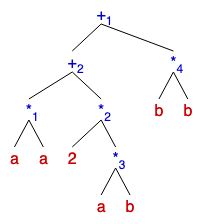
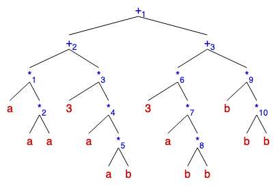
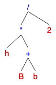
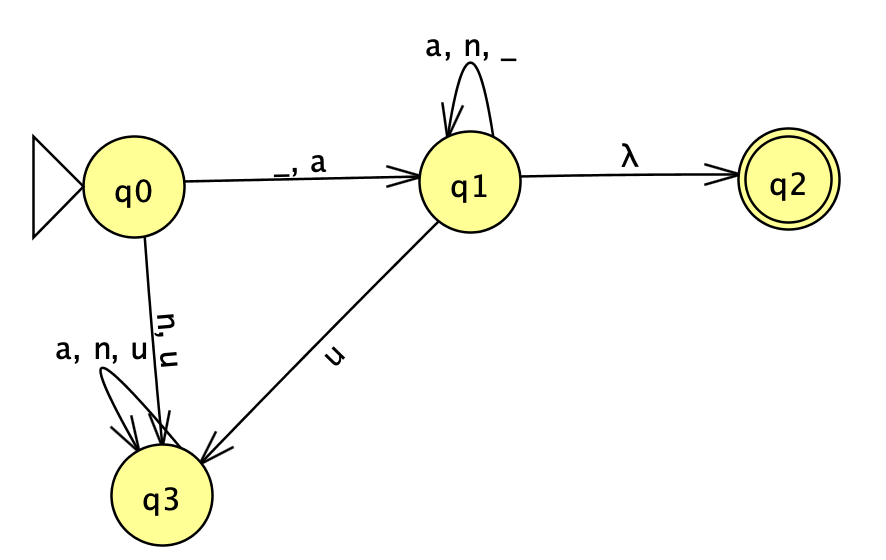
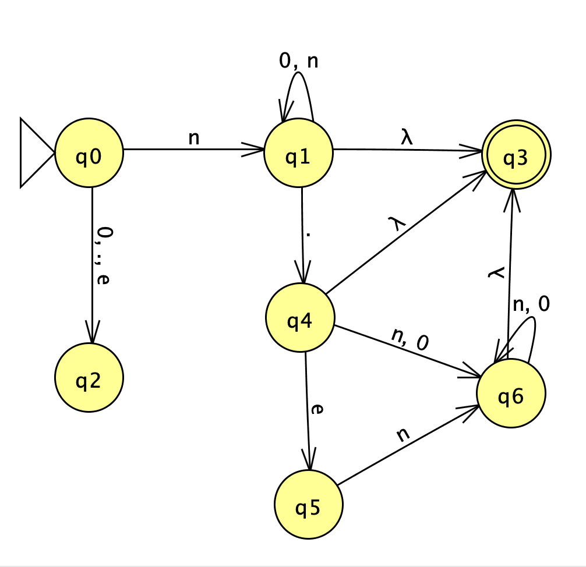

# Class Activity 02
#### Juan Antonio Melendres Villa 		A00369017 ####

Answer the following questions:

1. Generar los árboles sintácticos para:

	1.1 (a+b)^2 forma expandida aa + 2ab + bb:

	
		
	1.2 (a+b)^3 forma expandida aaa + 3aab + 3abb + bbb:

	

	1.3 Área del trapecio h(a+b/2):

	

2. Diseñar el Autómata Finito y la Gramática Regular para generar/aceptar los identificadores en JAVA

	u: Unicode
	n: Número (1-9).
	a: Alfabeto (a - z, A - Z)
	λ: Espacio

	

	Gramatica:

	S -> aA | _ A
	A -> aA | _ A | nA | a | _ | n

3. Diseñar el Autómata Finito para aceptar los números definidos en clase:

	Entero (1), Real (1.1), Exponencial (1.1e1)

	λ:Nada (no recibe nada) 
	n: Número (1-9).

	

4. Diseñar la Gramática Libre de Contexto para generar expresiones aritméticas:

	( ( n + n ) / n - n * n ) n = Número (0-9).

	S -> A| (S) | SS | S + S | S – S | S * S | S / S
	A -> n | nA
